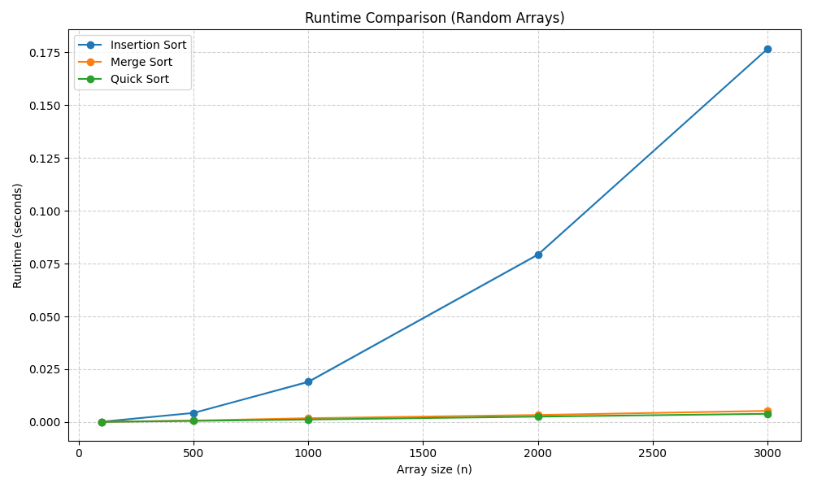
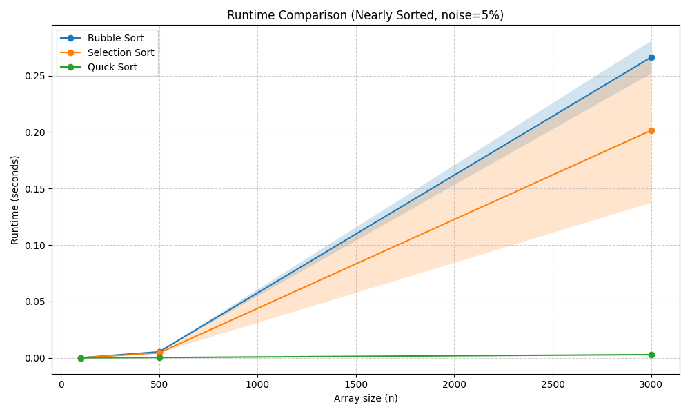

# Sorting Algorithm Comparison – Assignment 1

**Student:** Roei Keidar


## Selected Algorithms

| ID | Algorithm       | Time Complexity (avg) |
|----|-----------------|----------------------|
| 3  | Insertion Sort  | O(n²)                |
| 4  | Merge Sort      | O(n log n)           |
| 5  | Quick Sort      | O(n log n)           |

---

## How to Run

### Default (generates result1.png and result2.png)
```bash
python run_experiments.py
```

### Custom run with CLI arguments
```bash
python run_experiments.py -a 1 2 5 -s 100 500 3000 -e 1 -r 20
```

| Flag | Description |
|------|-------------|
| `-a` | Algorithm IDs: 1=Bubble, 2=Selection, 3=Insertion, 4=Merge, 5=Quick |
| `-s` | Array sizes to test |
| `-e` | Experiment type: 1 = 5% noise, 2 = 20% noise |
| `-r` | Number of repetitions per measurement |

---

## Results

### result1.png – Random Arrays (Part B)



**Explanation:**  
Insertion Sort shows clear O(n²) growth – its runtime rises steeply as array size increases. Merge Sort and Quick Sort both follow O(n log n) growth and remain nearly flat in comparison. Quick Sort is slightly faster in practice due to lower constant factors and better cache behaviour. The shaded bands show standard deviation across 5 repetitions; Insertion Sort has higher variance because each random array can vary significantly in how many shifts are needed.

---

### result2.png – Nearly Sorted Arrays (5% noise, Part C)



**Explanation:**  
On nearly sorted arrays, Insertion Sort improves dramatically – it approaches O(n) behaviour because very few elements are out of place and few shifts are needed. Merge Sort is unaffected by input order and still runs in O(n log n). Quick Sort also stays fast. Compared to result1.png, the most notable change is that the gap between Insertion Sort and the O(n log n) algorithms is much smaller (or even reversed for small sizes). This confirms that Insertion Sort is well-suited for nearly sorted data, which matches the theoretical analysis.
